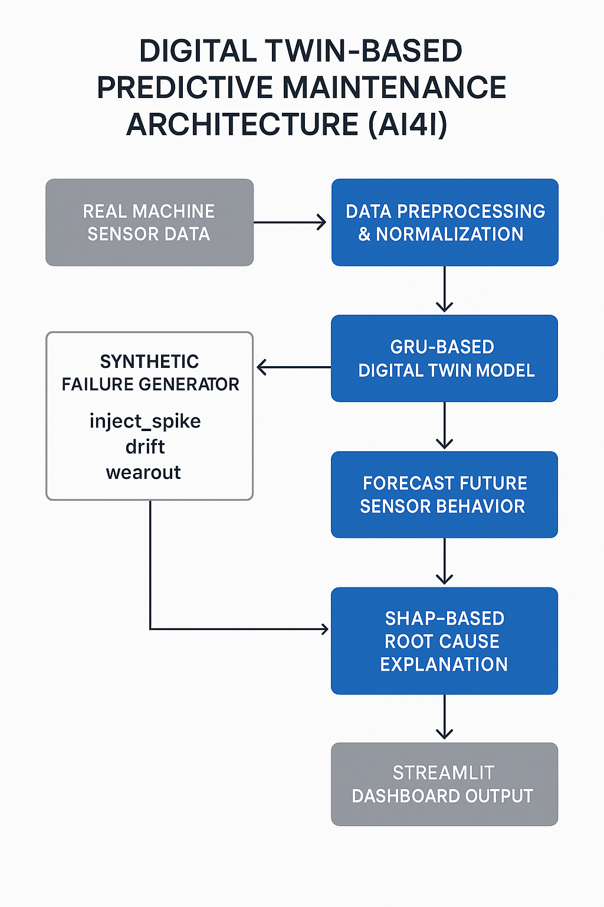
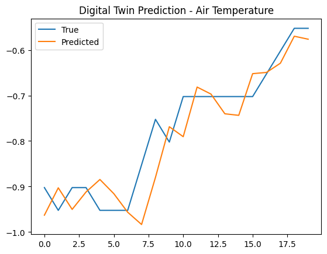

# Digital Twin AI4I – Predictive Maintenance with GRU + Streamlit

This project implements a full **Digital Twin system** for simulating, predicting, and diagnosing machine failures using the [AI4I 2020 industrial dataset](https://archive.ics.uci.edu/ml/datasets/AI4I+2020+Predictive+Maintenance+Dataset).  
It includes a PyTorch-based GRU model, synthetic failure generation, deviation scoring, SHAP-based root cause explanations, and an interactive Streamlit dashboard. [streamlit](https://digital-twin-ai4i.streamlit.app/)


---

## Key Features

- **Digital Twin Model**: GRU network trained on healthy sensor data to emulate real machine behavior
- **Synthetic Failure Generator**: Inject faults like torque spikes, overheating, or tool wear
- **Anomaly Detection**: Compare real vs predicted signals and compute deviation scores
- **Failure Classifier**: Detect if a sensor window contains a failure (trained on synthetic + real data)
- **SHAP Explanations**: Explain predictions using SHAP force and summary plots
- **Streamlit UI**: Simulate and visualize sensor faults, twin deviation, and alert generation
<p align="center">
  
</p>
---

## Project Structure
```text
digital-twin-ai4i/
├── data/
│   ├── raw/                         # Original dataset (ai4i2020.csv)
│   ├── processed/                   # Cleaned, normalized time-series data
│   └── synthetic/                   # Failure-injected synthetic datasets
│
├── notebooks/
│   ├── 01_data_exploration.ipynb    # Initial EDA, visualization
│   ├── 02_digital_twin_model.ipynb  # Forecast model (GRU/LSTM/Prophet)
│   ├── 03_synthetic_failure_gen.ipynb # Inject and label synthetic anomalies
│   ├── 04_failure_classifier.ipynb  # Train failure prediction model
│   └── 05_shap_explanations.ipynb   # SHAP visualizations for root cause
│
├── twin_model/
│   ├── __init__.py
│   ├── model.py                     # GRU/Prophet model logic
│   ├── train.py                     # Training and evaluation functions
│   └── utils.py                     # Preprocessing, plotting, normalization
│
├── simulator/
│   ├── scenario_runner.py           # Run what-if scenarios
│   ├── deviation_score.py           # Measure twin vs real behavior
│   └── synthetic_data_tools.py      # Inject faults, add drift
│
├── app/
│   ├── streamlit_app.py             # UI for dashboard (optional)
│   └── plots/                       # Saved charts and overlays
│
├── models/
│   ├── twin_model.pkl               # Saved model weights
│   ├── classifier_model.pkl         # Failure prediction model
│   └── scaler.pkl                   # Normalization scaler
│
├── outputs/
│   ├── reports/                     # Model summary, metrics
│   └── visualizations/              # SHAP, twin overlays
│
├── requirements.txt
├── README.md
└── digital_twin_architecture.png    # System diagram (for blog/paper)
```

---

## Getting Started

### 1. Clone the Repo
```bash
git clone https://github.com/yourname/digital-twin-ai4i.git
cd digital-twin-ai4i
```

### 2. Install Dependencies
```
pip install -r requirements.txt
```

### 3. Run Digital Twin Demo (Command Line)
```
python run_demo.py
```

### 4. Launch Streamlit UI
```
streamlit run app/streamlit_app.py
```

### Notebooks Included
- 01_data_exploration.ipynb – Exploratory data analysis


- 02_digital_twin_model.ipynb – GRU training
- 03_synthetic_failure_gen.ipynb – Failure injection
- 04_failure_classifier.ipynb – Fault classification
- 05_shap_explanations.ipynb – Model interpretability

### Technologies Used

- PyTorch – GRU-based time-series modeling
- scikit-learn – Failure classifier, preprocessing
- SHAP – Model explainability
- Streamlit – Interactive dashboard
- Seaborn / Matplotlib – Visualizations


## License
This project is licensed under the MIT License.

## 👨‍💻 Author
**Raj Kumar Myakala**  
AI | Data | Automation | GCP | Python  
[LinkedIn ](https://www.linkedin.com/in/raj-kumar-myakala-927860264/)  
[GitHub ](https://github.com/rajkumar160798)

---

>  If you like this project, consider starring the repo and following my GitHub for more AI/ML innovations!
